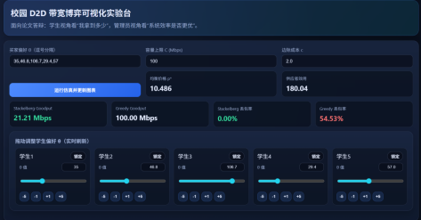
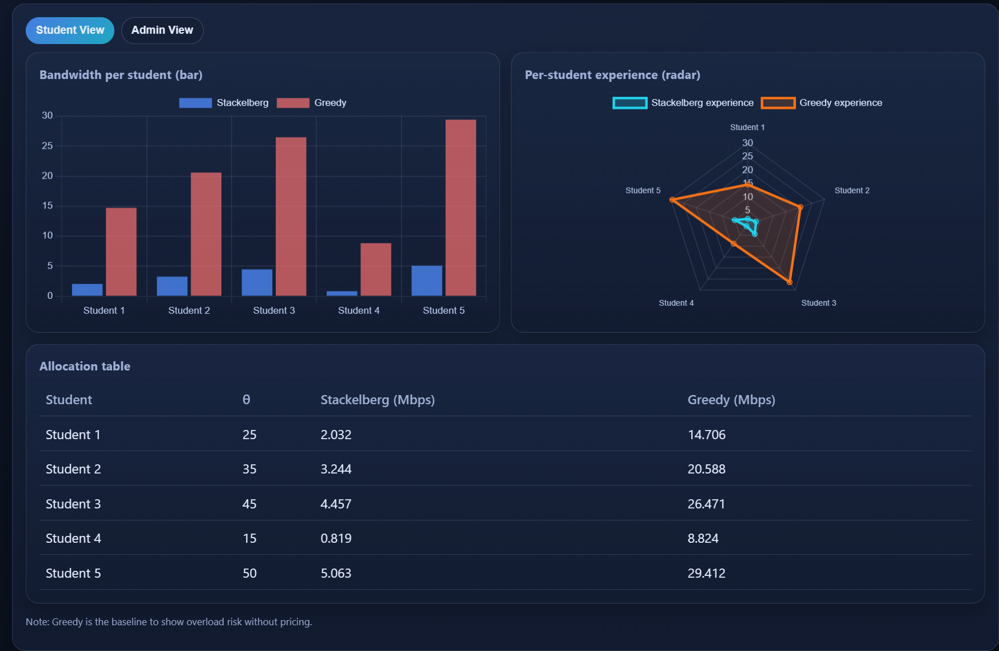
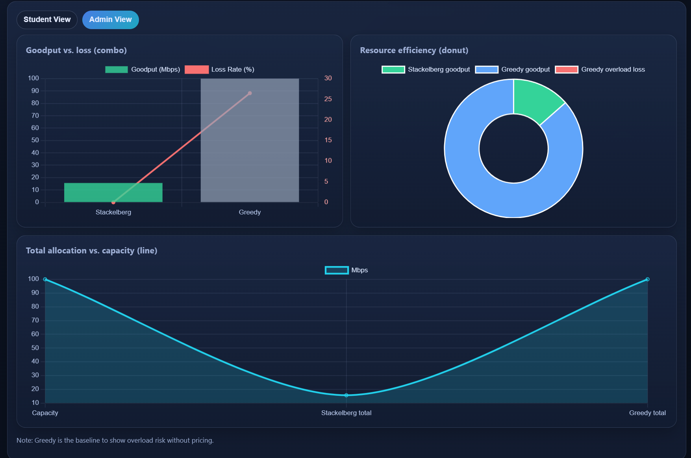

# Campus D2D Stackelberg Demo

This is a visualization demo that implements the paper’s strategy, including:

- Student view: see bandwidth allocation per student under Stackelberg vs. Greedy
- Admin view: system Goodput, loss rate, supplier utility, equilibrium price
- Backend API: `FastAPI` simulation endpoint

## Image

<div align="center">
  
</div>

<div align="center">
  
  
</div>

## Structure

- `backend/app/main.py`: backend and core strategy logic
- `frontend/index.html`: frontend dashboard (student/admin views)
- `experiment.py`: NS-3 Python bindings simulation script 
- `run_demo.py`: local entry point

## Experiment (NS-3)

The experiment code lives under `experiment/` and is designed to run on a Linux
or macOS environment with NS-3 installed.

D2D-demo/experiment/d2d-sharing.cc implements the NS-3 simulation comparing the Stackelberg pricing strategy against a greedy baseline. 
It uses FlowMonitor to collect per-flow statistics, which are then parsed by `experiment/plot_results.py` to generate the figures shown in the demo.

**Key files**
- `experiment/d2d-sharing.cc`: NS-3 simulation (Stackelberg vs. greedy)
- `experiment/plot_results.py`: FlowMonitor parsing and figure generation

**Dependencies**
- NS-3 (tested with 3.35+)
- C++ toolchain with C++17 support (GCC or Clang)
- Python 3.8+ with `matplotlib`

**Environment notes**
- A POSIX shell (bash/zsh) is recommended
- Running inside WSL or a Linux VM is supported
- FlowMonitor XML outputs are parsed locally to produce figures

## Quick Start (Windows PowerShell)

```powershell
cd e:\llxpaper\project1\demo
python -m venv .venv
.\.venv\Scripts\Activate.ps1
pip install -r requirements.txt
python run_demo.py
```

Open after startup:

- `http://127.0.0.1:8000`
- Health check: `http://127.0.0.1:8000/api/health`

## API

- `POST /api/simulate`

Example request:

```json
{
  "buyers_theta": [25, 35, 45, 15, 50],
  "cost_c": 2.0,
  "capacity_mbps": 100.0
}
```

## Notes

The backend uses the paper’s closed-form equations and capacity constraints for a fast comparison, suitable for demos and presentations.
You can extend `backend/app/main.py` later to parse NS-3 outputs (e.g., FlowMonitor XML) and replace the approximate metrics.
